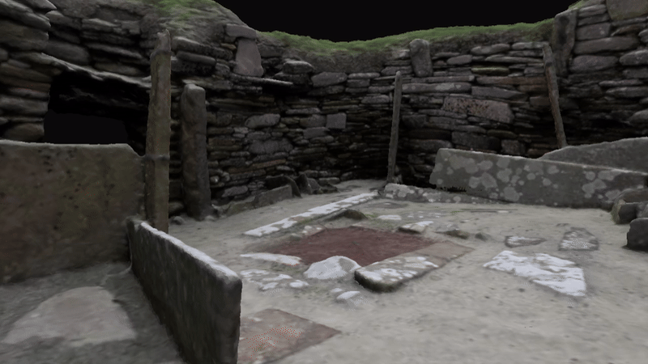

# Archaeology Site Explorer 🏛️

<p align="center">
  
</p>

A browser app for flying freely around real archaeological sites in 3D. Sites are
built from 3D Gaussian splats or photogrammetry meshes, rendered with Three.js and
[`@sparkjsdev/spark`](https://github.com/sparkjsdev/spark). Works with WASD + mouse on
desktop and touch/gyro controls on mobile. Other visitors to the same site show up as
avatars, with names and emotes.

Only one site is live so far, Skara Brae. The app doesn't reconstruct sites from your
own photos or video — splats are trained offline and added as a site config.

## Try it 🚀

Live at [archeaology-site-explorer.vercel.app](https://archeaology-site-explorer.vercel.app).
Pick a site from the picker screen to fly into it; anyone else there at the same time
shows up as a colored avatar.

## Development 🛠️

Requires Node 18+.

```
git clone https://github.com/Gidntsquia/archeaology-site-explorer
cd archeaology-site-explorer
npm install
npm run dev   # Vite + the multiplayer relay together, http://localhost:5173
```

On a phone, use a tunnel (`npx cloudflared tunnel --url http://localhost:5173`) since
the dev server on `localhost` isn't reachable from a phone over WSL2's default
networking.

IMPORTANT: mobile testing serves the built `dist/` output via `vite preview`, not the
dev server — run `npm run build` after editing `src/` before testing on a phone.

Other commands:

```
npm run build     # Production build to dist/
npm run preview   # Serve the production build locally
npm run relay      # Run just the multiplayer relay server
```

## Features 🔬

- Free-fly camera with WASD + mouse on desktop, touch joystick and gyro look on mobile.
- Sites load either a Gaussian splat (`.spz`/`.ksplat`) or a glTF mesh, picked per site
  in its JSON config.
- A bounds spring keeps the camera inside the well-captured area of a site instead of
  flying off the edge into empty space.
- Hotspots mark points of interest in a site and show info panels on approach.
- Loading progress bar tracks the splat/mesh download.
- Handles WebGL context loss with a reload prompt instead of a blank screen.
- Other people in the same site appear as colored avatars with names, synced over a
  WebSocket relay, and can wave or raise a hand.

## Documentation 📚

More details in the
[wiki](https://github.com/Gidntsquia/archeaology-site-explorer/wiki):

- [Plan](https://github.com/Gidntsquia/archeaology-site-explorer/wiki/Plan) — rendering approach, site config format, data pipeline, roadmap
- [Mobile Setup](https://github.com/Gidntsquia/archeaology-site-explorer/wiki/Mobile-Setup) — reaching the dev server from a phone, touch controls, asset size
- [Training a Splat](https://github.com/Gidntsquia/archeaology-site-explorer/wiki/Training-a-Splat) — capturing photos/video and training a site with COLMAP/gsplat
- [Multiplayer](https://github.com/Gidntsquia/archeaology-site-explorer/wiki/Multiplayer) — relay protocol, avatars, Render/Vercel deployment

## License 📄

[MIT](LICENSE) for the code. Individual sites carry their own license — see each site's
`credit` field in `src/sites/*.json`; some (e.g. Skara Brae) are CC BY-NC and
educational-use only.
