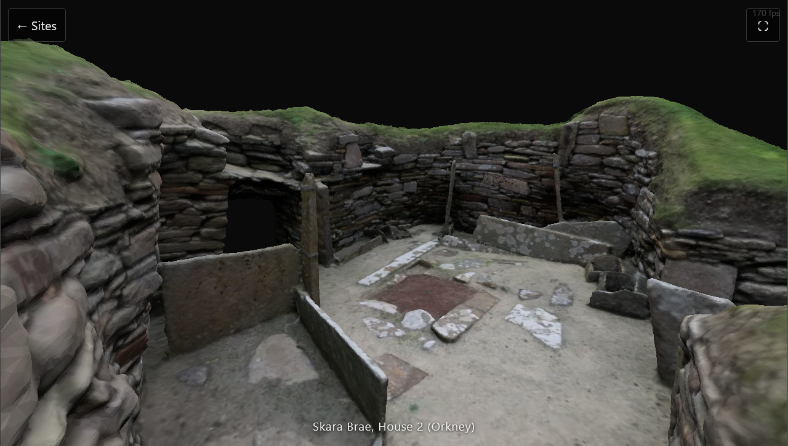

# Archaeology Site Explorer 🏛️

<p align="center">
  
</p>

A browser app for flying freely around real archaeological sites in 3D. Sites are built
from 3D Gaussian splats (reconstructed from photos or video) or photogrammetry meshes,
rendered with Three.js and [`@sparkjsdev/spark`](https://github.com/sparkjsdev/spark).
Works with WASD + mouse on desktop and touch/gyro controls on mobile.

## Quickstart 🚀

Requires Node 18+.

```
git clone https://github.com/Gidntsquia/archeaology-site-explorer
cd archeaology-site-explorer
npm install
npm run dev   # Open http://localhost:5173
```

Pick a site from the picker screen to fly into it. On a phone, use a tunnel
(`npx cloudflared tunnel --url http://localhost:5173`) since the dev server on
`localhost` isn't reachable from a phone over WSL2's default networking.

IMPORTANT: mobile testing serves the built `dist/` output via `vite preview`, not the
dev server — run `npm run build` after editing `src/` before testing on a phone.

Other commands:

```
npm run build     # Production build to dist/
npm run preview   # Serve the production build locally
```

## Features 🔬

- Free-fly camera with WASD + mouse on desktop, touch joystick and gyro look on mobile.
- Sites load either a Gaussian splat (`.spz`/`.ksplat`) or a glTF mesh, picked per site
  in its JSON config.
- A bounds spring keeps the camera inside the well-captured area of a site instead of
  flying off the edge into empty space.
- Hotspots mark points of interest in a site and show info panels on approach.
- Loading progress bar tracks the splat/mesh download.
- Handles WebGL context loss with a reload prompt instead of a blank screen.

## Documentation 📚

More details in [docs](docs):

- [Plan](PLAN.md) — rendering approach, site config format, data pipeline, roadmap
- [Mobile Setup](MOBILE_PLAN.md) — reaching the dev server from a phone, touch controls, asset size
- [Training a Splat](scripts/train.md) — capturing photos/video and training a site with COLMAP/gsplat

## License 📄

[MIT](LICENSE) for the code. Individual sites carry their own license — see each site's
`credit` field in `src/sites/*.json`; some (e.g. Skara Brae) are CC BY-NC and
educational-use only.
